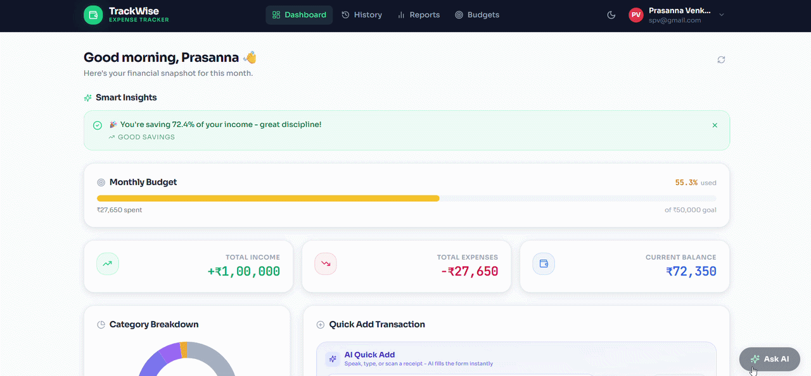
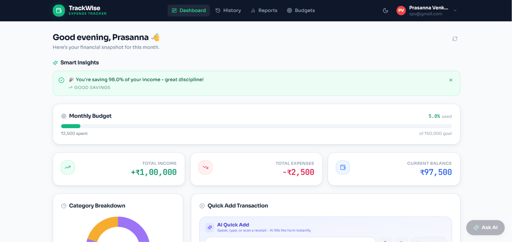
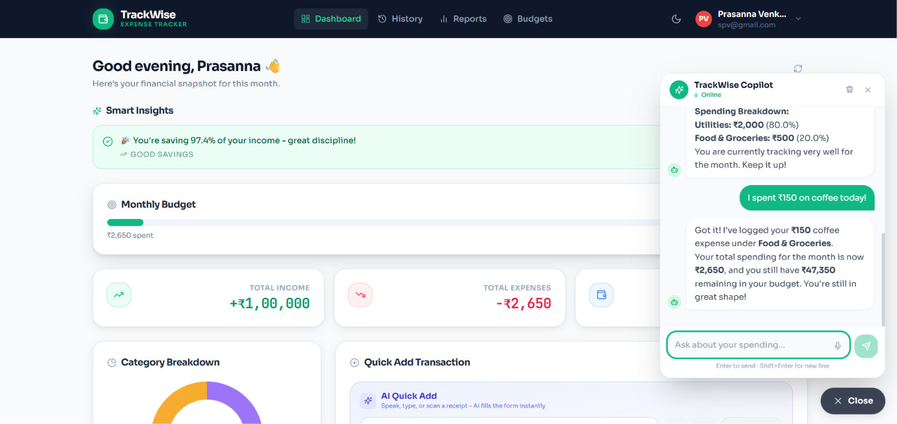
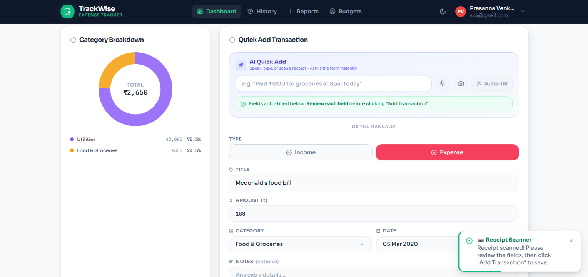
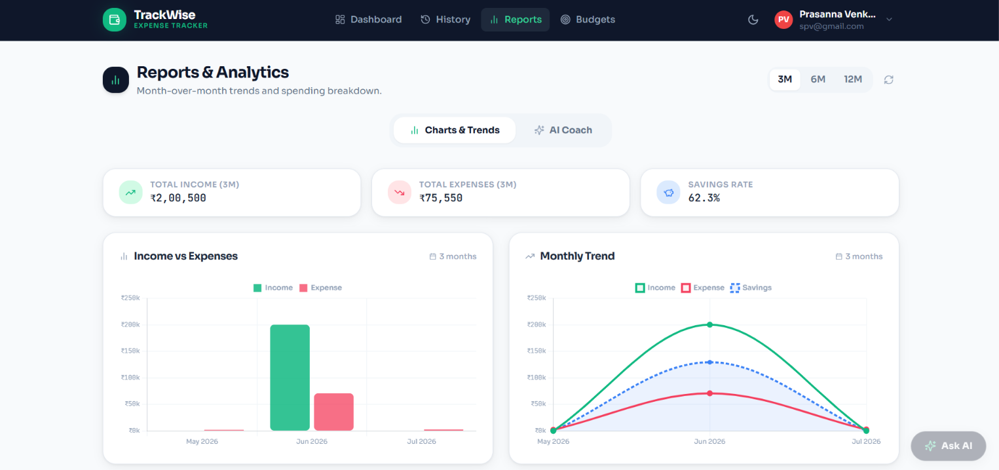
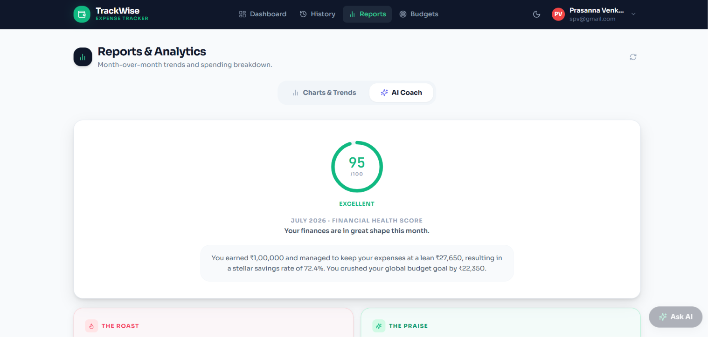
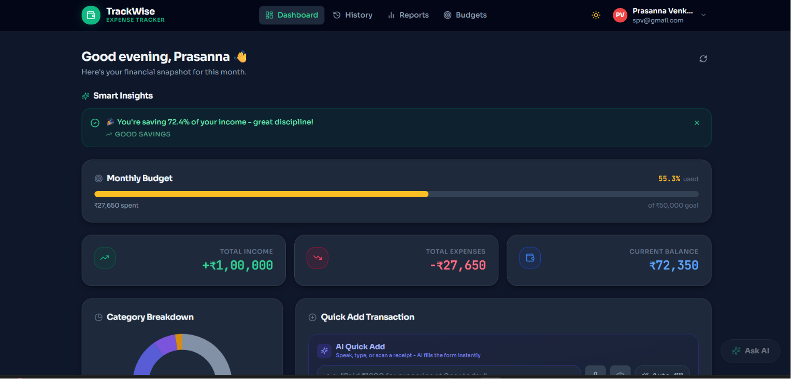
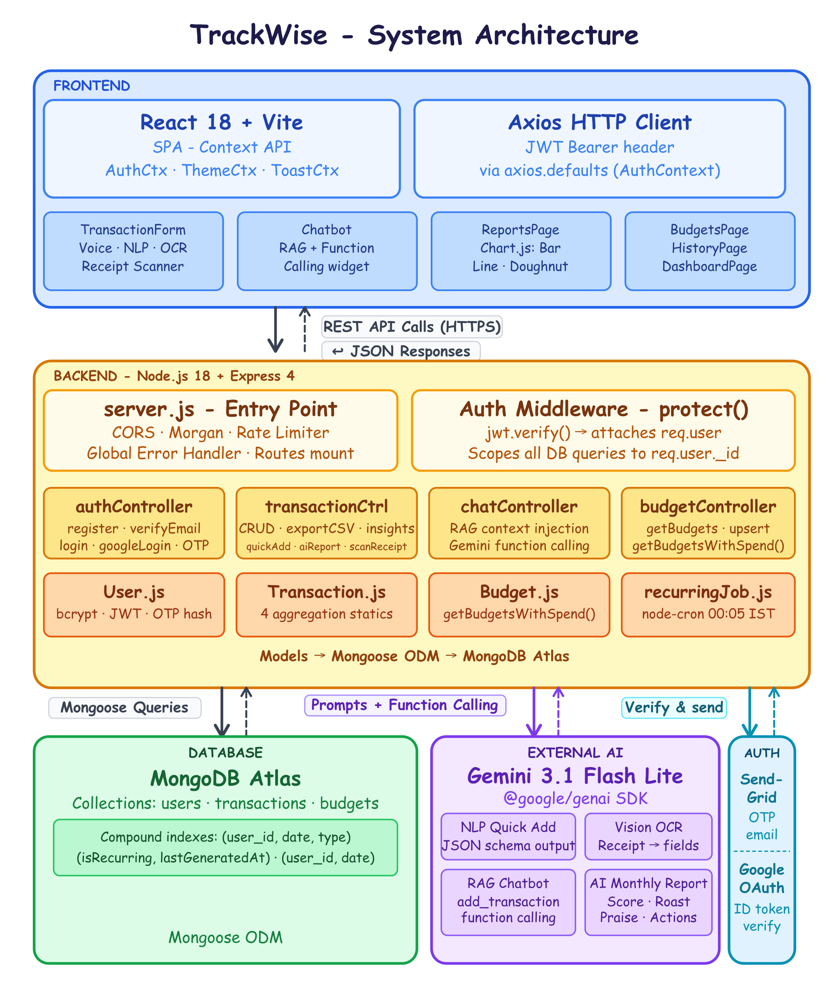

<div align="center">

# TrackWise

### Expense tracking that doesn't require you to think about expense tracking.

Log transactions by typing naturally, speaking a sentence, or photographing a receipt.  
TrackWise uses Gemini 3.1 Flash Lite to handle the categorization, parsing, and analysis - so you don't have to.

[](https://react.dev)
[](https://nodejs.org)
[](https://expressjs.com)
[](https://mongodb.com)
[](https://vitejs.dev)
[](https://tailwindcss.com)
[](https://ai.google.dev)

---

[🚀 Live Demo](https://use-trackwise.vercel.app/) · [🏗️ Architecture](#architecture) · [🎬 Demo Video](https://www.linkedin.com/posts/prasannavenkatesh-s_buildinpublic-fullstack-mern-activity-7483116802378465280-DgaB) · [🛠️ Tech Stack](#tech-stack) · [📖 Docs](#local-development)

</div>

<p align="center">
  
</p>

---

## Why I Built This

Every expense tracker I tried had the same problem: it still made me do all the work. Open app, tap category, type amount, hit save - for every coffee.

The entry barrier is why people stop using them.

I wanted to see how much of that friction could be removed with a generative model. The result is TrackWise: you speak, photograph, or type a sentence, and the app figures out the rest. The AI is part of the core data-entry loop, not a reporting add-on.

---

## Features

| Feature                     | Description                                                                                                                                                                                       |
| --------------------------- | ------------------------------------------------------------------------------------------------------------------------------------------------------------------------------------------------- |
| **AI Copilot Chatbot**      | A floating chat widget that answers questions about your own spending using a RAG pipeline built on your live transaction history, and can log new expenses directly via Gemini function calling. |
| **Receipt Scanner**         | Upload or photograph a receipt; Gemini Vision OCR extracts the merchant, amount, and category automatically.                                                                                      |
| **Voice Logging**           | Dictate an expense using the Web Speech API - the mic button feeds directly into the NLP Quick Add parser.                                                                                        |
| **NLP Quick Add**           | Type a sentence like _"₹450 on lunch at Saravana Bhavan"_ and Gemini parses it into a structured transaction.                                                                                     |
| **AI Monthly Report**       | On-demand AI analysis of your month: a financial health score, a critique, praise, and three prioritized action items.                                                                            |
| **Google OAuth + OTP Auth** | Sign in with Google, or register with email and a 6-digit OTP sent via SendGrid (15-minute expiry, SHA-256 hashed at rest).                                                                       |
| **Per-Category Budgets**    | Set monthly limits per category; the dashboard shows a live health strip and warns as limits approach.                                                                                            |
| **Recurring Transactions**  | Mark any expense as recurring; a cron job auto-generates copies daily at 00:05 IST.                                                                                                               |
| **Analytics Dashboard**     | Doughnut, bar, and line charts across 3M / 6M / 12M windows, powered by Chart.js.                                                                                                                 |
| **Dark Mode**               | System-aware dark/light toggle persisted to `localStorage` via Tailwind's `class` strategy.                                                                                                       |

---

## Screenshots

| Dashboard | AI Chat | Receipt Scanner |
|:---------:|:-------:|:---------------:|
|  |  |  |

| Reports | AI Coach | Dark Mode |
|:-------:|:--------:|:---------:|
|  |  |  |
---

## Engineering Challenges & Design Decisions

This section covers decisions that weren't obvious and why I made them.

### Enforcing Reliable Output from a Generative Model

The NLP Quick Add feature needs Gemini to return a specific five-field JSON object on every call, with no extra text, no markdown fences, and no invented fields.

The challenge: language models don't do that by default.

The solution involved three layers:

1. **`responseMimeType: "application/json"`** on the API call tells the model to constrain its output format.
2. A **strict system prompt** defines the exact schema - field names, types, and allowed enum values for `category`.
3. The response goes through **`JSON.parse` in a try/catch**, with a fallback repair step for truncated output, followed by field-level sanitization. If a field is missing or the category doesn't match the enum, a safe fallback is applied instead of surfacing an error.

A lazy `getGenAI()` singleton also means a missing API key only breaks AI routes - the rest of the app still works.

---

### Personalized AI Chatbot with RAG

A generic LLM gives generic financial advice. That's not useful.

Before each chat message is sent to Gemini, the backend runs several Mongoose queries in parallel:

- Recent transactions (last 15)
- Monthly category breakdown
- Active budget limits and current spend

That data is injected directly into the system prompt so the model is answering questions about the user's actual money, not textbook scenarios.

---

### Letting the AI Log Expenses Directly via Function Calling

Parsing a chatbot's natural-language reply with regex to extract an amount and category is fragile - the model might phrase a confirmation a dozen different ways.

Instead, the chatbot registers an `add_transaction` tool with Gemini's function-calling API. When a message describes spending money, Gemini responds with a structured function call (not free text) containing the title, amount, type, category, and date - all validated against the same enums as the rest of the app.

The backend validates the arguments, saves the transaction to MongoDB, then sends the result back to Gemini as a `functionResponse` so it can generate a natural confirmation in a second turn. This costs an extra round trip per logged expense, but it means the save is never dependent on parsing free-form text - the model is contractually shaped by the tool's schema instead.

---

### Preserving Chat State Across Navigation

The chatbot is mounted once in `App.jsx`, outside `<Routes>`. This means the conversation persists when the user navigates between pages - the component never unmounts.

A sliding window (`history.slice(-6)`) caps context to the six most recent turns. This keeps token usage predictable and avoids sending the entire conversation history on every request. The window is also sanitized to ensure it always starts with a user turn, which the `@google/genai` SDK requires.

---

### Voice Input Without Stale Closures

The mic button uses the Web Speech API's `onresult` callback, which fires asynchronously. React's closure model means a naive implementation captures a stale reference to the input field.

The fix is an `activeFieldRef` that holds a ref to the current active input. The async callback reads from the ref instead of the closure, so it always writes to the correct field regardless of when it fires.

---

### One Cron Job Instead of Three

Recurring transactions can be daily, weekly, or monthly. The obvious approach is three separate cron schedules - one per frequency.

Instead, a single job runs daily at 00:05 IST and checks each recurring transaction's `lastGeneratedAt` timestamp against its frequency to decide if it's due. This means there's one place to debug instead of three, and it's resilient to downtime: if the server is down at midnight, the job still catches up correctly on the next run instead of silently missing a day.

---

## Security

- Passwords are hashed with **bcrypt at 12 salt rounds** before being stored; the field is `select: false` in the schema so it's never returned by a query unless explicitly requested.
- OTPs are **SHA-256 hashed** before storage with a 15-minute expiry - the plaintext code only ever exists in the email sent to the user.
- **JWT-based auth** on every protected route; the `protect` middleware attaches `req.user` from the verified token, and every controller scopes its database queries to `req.user._id` so one user can never read or modify another's data.
- **Rate limiting** is applied separately to `/api/auth/*` (15 requests / 15 minutes, brute-force protection) and `/api/transactions/quick-add` (10 requests / minute, to protect the Gemini quota).
- **Google OAuth tokens are verified server-side** via `google-auth-library` before a session is issued - the frontend never trusts a token it receives without backend verification.
- The Gemini API key lives only in the backend `.env` file. AI requests always go through Express, never directly from the browser.

---

## Architecture

<a name="architecture"></a>

<p align="center">
  
</p>

---

## Tech Stack

**Frontend**
React 18 · Vite 5 · Tailwind CSS 3 · Chart.js 4 · react-markdown · lucide-react

**Backend**
Node.js 18 · Express 4 · express-rate-limit · multer · morgan

**Database**
MongoDB Atlas · Mongoose 8

**AI**
Gemini 3.1 Flash Lite via `@google/genai` - chat with function calling, Vision OCR, NLP parsing, monthly reports

**Authentication**
JWT · bcryptjs · Google OAuth (`google-auth-library`) · SendGrid OTP email

**Scheduling**
node-cron - recurring transaction processor

**Deployment**
Frontend: Vercel · Backend: Render · Database: MongoDB Atlas

---

## API Overview

A representative subset of endpoints. Full route map is in `/backend/routes/`.

| Method | Endpoint                         | Description                                                             |
| ------ | -------------------------------- | ----------------------------------------------------------------------- |
| `POST` | `/api/auth/register`             | Register with email; triggers OTP email                                 |
| `POST` | `/api/auth/login`                | Email/password login; returns JWT                                       |
| `POST` | `/api/auth/google-login`         | Verify Google ID token; find-or-create user                             |
| `POST` | `/api/transactions`              | Create a transaction                                                    |
| `GET`  | `/api/transactions`              | Fetch all transactions for the authenticated user                       |
| `PUT`  | `/api/transactions/:id`          | Edit an existing transaction                                            |
| `POST` | `/api/transactions/quick-add`    | Parse a natural language string into a transaction via Gemini           |
| `POST` | `/api/transactions/scan-receipt` | OCR a receipt image via Gemini Vision                                   |
| `GET`  | `/api/transactions/ai-report`    | Generate the monthly AI financial report                                |
| `POST` | `/api/chat`                      | Send a message to the RAG chatbot (supports tool-based expense logging) |
| `GET`  | `/api/budgets`                   | Fetch budgets with live spend totals                                    |
| `POST` | `/api/budgets`                   | Create or update a category budget (upsert)                             |

---

## Design Notes

- Chat context is capped at the **last 6 message turns** to keep token usage stable.
- Monthly AI reports are **generated on demand** - no background processing needed.
- Recurring transactions are processed by a single cron job at **00:05 IST daily**, with per-document idempotency checks instead of separate jobs per frequency.
- Receipt OCR sends the image as a base64 `inlineData` payload - no file is persisted to the server.
- A missing `GEMINI_API_KEY` breaks only AI routes; all other routes remain functional.

---

## Project Structure

<details>
<summary>Expand project structure</summary>

```
smart-expense-tracker/
│
├── backend/
│   ├── config/
│   │   └── db.js                         # Mongoose connection helper
│   ├── controllers/
│   │   ├── authController.js             # register (OTP flow), verifyEmail, resendOtp,
│   │   │                                 #   login, googleLogin, getMe, updateProfile,
│   │   │                                 #   changePassword, deleteAccount,
│   │   │                                 #   forgotPassword, resetPassword
│   │   ├── budgetController.js           # getBudgets, createOrUpdate, deleteBudget,
│   │   │                                 #   getBudgetSummary
│   │   ├── chatController.js             # handleChat - RAG + function-calling chatbot
│   │   └── transactionController.js      # getAllTransactions, createTransaction,
│   │                                     #   editTransaction, deleteTransaction,
│   │                                     #   getSummary, getInsights, exportCSV,
│   │                                     #   getTitleSuggestions, getMonthlyTrend,
│   │                                     #   parseQuickAdd, generateAIReport,
│   │                                     #   parseReceiptImage
│   ├── jobs/
│   │   └── recurringJob.js               # node-cron daily scheduler (00:05 IST)
│   ├── middleware/
│   │   └── authMiddleware.js             # JWT protect middleware
│   ├── models/
│   │   ├── Budget.js                     # Per-category monthly limit schema +
│   │   │                                 #   getBudgetsWithSpend() aggregation static
│   │   ├── Transaction.js                # Full transaction schema + aggregation statics
│   │   └── User.js                       # User schema + bcrypt hook + OTP fields +
│   │                                     #   matchPassword() + getSignedJwtToken()
│   ├── routes/
│   │   ├── auth.js                       # /api/auth/*          (13 endpoints)
│   │   ├── budgets.js                    # /api/budgets/*        (4 endpoints)
│   │   ├── chat.js                       # /api/chat/*           (1 endpoint)
│   │   └── transactions.js              # /api/transactions/*   (12 endpoints)
│   └── server.js                         # Express entry, rate limiting, error handler
│
└── frontend/
    └── src/
        ├── components/
        │   ├── Chatbot.jsx               # Floating RAG + function-calling chat widget
        │   ├── ExpenseChart.jsx          # Chart.js Doughnut (dark-mode reactive)
        │   ├── Navbar.jsx                # Nav, dark toggle, user dropdown
        │   ├── Onboarding.jsx            # 3-step wizard (shown once per new user)
        │   ├── SmartInsights.jsx         # Dismissible AI insight banners
        │   ├── ToastContainer.jsx        # Portal-rendered toast stack
        │   ├── TransactionForm.jsx       # Add form + Voice + NLP + Receipt Scanner
        │   └── TransactionTable.jsx      # History table + search + edit/delete modals
        ├── context/
        │   ├── AuthContext.jsx           # JWT, axios header, Google OAuth token
        │   ├── ThemeContext.jsx          # Dark/light toggle, localStorage persist
        │   └── ToastContext.jsx          # Global toast state + useToast() hook
        ├── pages/
        │   ├── BudgetsPage.jsx           # Budget cards, month navigator, health strip
        │   ├── DashboardPage.jsx         # Stat cards, chart, quick-add, onboarding
        │   ├── HistoryPage.jsx           # TransactionTable + date range filter
        │   ├── LoginPage.jsx             # Email/password + Google Sign-In
        │   ├── RegisterPage.jsx          # Registration + OTP step
        │   ├── ReportsPage.jsx           # Charts + AI Coach tab (score, critique, actions)
        │   ├── SettingsPage.jsx          # Profile, password, delete account
        │   └── ...                       # ForgotPassword, ResetPassword, VerifyEmail, 404
        ├── App.jsx                       # Router + ProtectedRoute + ErrorBoundary + Chatbot
        ├── index.css                     # Tailwind + CSS vars + utility component classes
        └── main.jsx                      # React 18 createRoot + GoogleOAuthProvider
```

</details>

---

## Local Development

**Prerequisites:** Node.js ≥ 18, a free [MongoDB Atlas](https://mongodb.com/atlas) cluster, a [Google AI Studio](https://aistudio.google.com/apikey) API key, a [SendGrid](https://sendgrid.com) API key, and Google OAuth credentials.

### 1 - Backend

```bash
cd backend
npm install
cp .env.example .env
# Fill in the variables listed below
npm run dev
# API running at http://localhost:5000
```

### 2 - Frontend

```bash
cd frontend
npm install
cp .env.example .env
# Set VITE_GOOGLE_CLIENT_ID
npm run dev
# App running at http://localhost:5173
```

> Vite proxies all `/api` requests to Express in development - no CORS configuration needed locally.

### Other Scripts

```bash
# Backend
npm start          # Start without nodemon

# Frontend
npm run build      # Production build → dist/
npm run preview    # Preview production build locally
```

---

## Environment Variables

```env
# backend/.env

PORT=5000
NODE_ENV=development

MONGO_URI=mongodb+srv://<user>:<pass>@<cluster>.mongodb.net/expense_tracker

# Generate with: node -e "console.log(require('crypto').randomBytes(64).toString('hex'))"
JWT_SECRET=your_64_char_secret
JWT_EXPIRE=7d

CLIENT_ORIGIN=http://localhost:5173

# https://aistudio.google.com/apikey
GEMINI_API_KEY=your_gemini_api_key

# https://console.cloud.google.com → APIs & Services → Credentials
GOOGLE_CLIENT_ID=your_google_oauth_client_id

# https://app.sendgrid.com → Settings → API Keys
SENDGRID_API_KEY=your_sendgrid_api_key
EMAIL_USER=your_verified_sender@example.com
```

```env
# frontend/.env

VITE_GOOGLE_CLIENT_ID=your_google_oauth_client_id
```

---

## Future Improvements

- [ ] Multi-currency support
- [ ] Family / shared wallets
- [ ] Offline mode with sync
- [ ] AI anomaly detection (unusual spending alerts)
- [ ] Docker + CI/CD pipeline
- [ ] Mobile app (React Native)

---

## About

Built and developed by [Prasanna Venkatesh](https://www.linkedin.com/in/prasannavenkatesh-s/) using the MERN stack and Gemini 3.1 Flash Lite to make expense tracking effortless.
